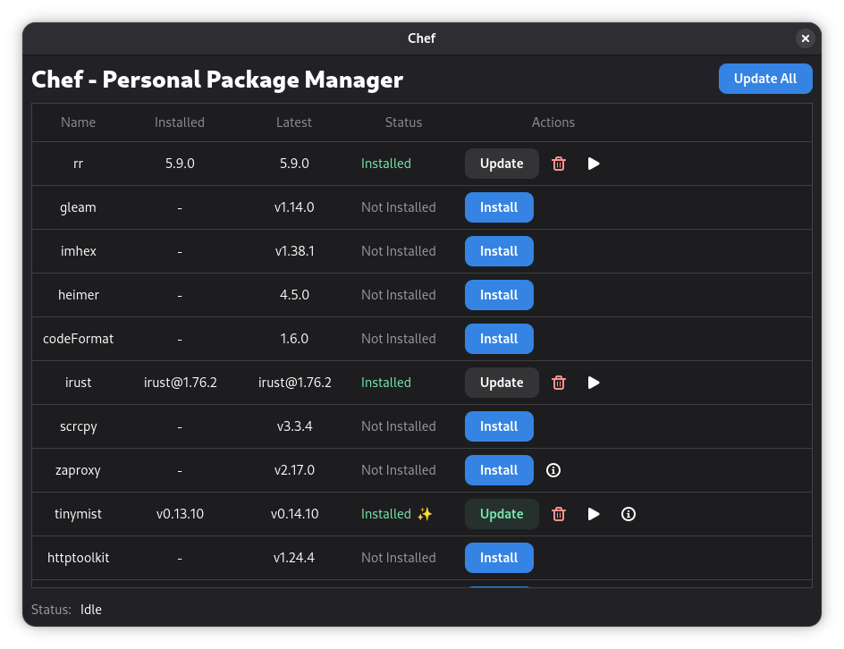

# Chef

Personal package manager

## Why it exists

This is useful for those binaries that are not packaged by a distro.

With chef you can:

- Install a random binary
- Keep it up-to-date
- Run it
- Automatically create desktop entries for GUI applications when specified in
  recipes

## Quick Start (Zero Config)

Install Chef globally to manage your binaries from anywhere:

```bash
deno install -gA jsr:@sigmasd/chef

# Now you can use the chef command directly
chef gui
chef list
```

## GUI Application

Chef comes with a GTK4 graphical user interface. You can install it as a
permanent desktop application:

```bash
chef gui --install
```



## Customizing Recipes

By default, Chef uses a recipes file located in your cache directory. To
customize your recipes, you can create a local script (e.g., `chef.ts`):

```typescript
import { $, Chef } from "jsr:@sigmasd/chef";
import { getLatestGithubRelease } from "jsr:@sigmasd/chef/utils";

const chef = new Chef();

chef.add({
  name: "irust",
  download: async ({ latestVersion }) => {
    await $.request(
      `https://github.com/sigmaSd/IRust/releases/download/${latestVersion}/irust-x86_64-unknown-linux-gnu`,
    ).showProgress().pipeToPath();
    await Deno.chmod("./irust-x86_64-unknown-linux-gnu", 0o555);
    return {
      exe: "./irust-x86_64-unknown-linux-gnu",
    };
  },
  version: () => getLatestGithubRelease("sigmaSd/IRust"),
  desktopFile: {
    comment: "Rust REPL",
    categories: "Development;",
    terminal: true,
  },
});

await chef.start(import.meta.url);
```

### Running your custom script

```bash
# Run your script directly
deno run -A chef.ts list

# You can also install your custom script as the global 'chef' command
deno install -gA -n chef chef.ts
chef gui
```

### Multiple Recipe Scripts

You can have multiple chef scripts for different purposes (e.g., `lsp.ts`,
`work.ts`). Each script manages its own set of binaries and settings
independently because of the `import.meta.url` passed to `chef.start()`.

```bash
deno run -A lsp.ts update
deno run -A work.ts list
```

## External Providers

Chef supports external providers, which allow you to integrate other package
managers or custom binary sources. Providers are external commands that
communicate with Chef using a JSON-based protocol.

You can use the Chef provider SDK to create your own providers.

Example provider: [rustman](https://jsr.io/@sigmasd/rustman) (A provider for
Rust binaries).

### Managing Providers

```bash
# Add a provider
chef provider add rustman "deno run -A jsr:@sigmasd/rustman"

# List providers
chef provider list

# Remove a provider
chef provider remove rustman
```

Once a provider is added, its binaries will appear in `chef list` and can be
managed just like native recipes.

## CLI Commands

- `chef update` to update all binaries
- `chef list` to list currently installed binaries
- `chef run ${binary} $args` to run an installed binary
- `chef link ${binary}` to create a symlink in `~/.cache/chef/exports` (add this
  to your PATH!)
- `chef gui [--install | --uninstall]` manage the Chef GUI application
- `chef desktop-file [create | remove] <binary>` manually manage desktop entries
- `chef --version` show chef version
